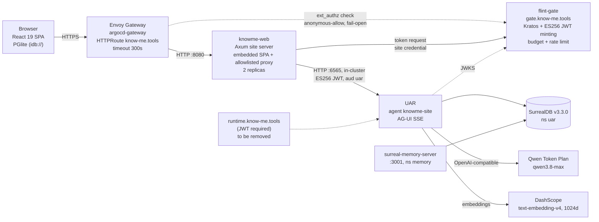

# 4. Architecture

This section describes how the agent-led site is built: what runs where, how an agent turn becomes pixels, and where the trust boundaries sit. Each element is labelled:

- **CURRENT**: exists in this repo's working tree or in UAR source. UAR source is cited as UAR main (e6a2caae); anchors checked at fefbf35e, read 2026-10-01.
- **PLANNED**: designed here, not built.
- **OPEN QUESTION**: needs a decision or a measurement before it can be designed.

Protocol facts cite their source. Code facts cite a file path, and a line where the claim depends on one. UAR paths are relative to the UAR repository root.

## 4.1 Components



**CURRENT.**
- `k8s/base/httproutes.yaml` routes `know-me.tools` to `knowme-web:8080` with a 300 s request timeout for SSE. It also routes `runtime.know-me.tools` straight to `uar:6565` (route `knowme-runtime`, lines 131-154).
- The HTTPS listeners on the gateway are a separate cluster change (plan change 4). That file states that the routes do not attach until that change merges.
- `docker-compose.yaml` runs the same four services locally with no proxy in front (`TRUSTED_PROXY_HOPS=0`).
- The memory server shares SurrealDB but uses its own namespace and local bge-small embeddings. The site agent has no configured path to it.
- Today the site server calls UAR directly and injects an `X-API-Key` that `scripts/seed-site-agent.sh` mints through `POST /api/uar/auth/keys` (step 4). The diagram shows the PLANNED design (§4.7): Envoy asks flint-gate to authorize each request, and the site server calls UAR with a gate-minted token in place of that key.

**The site agent's run policy (CURRENT in the working tree, verified locally by seeding).** `uar/agents/knowme-site.json` carries `extensions["uar.run_policy"]` with tools `selected` and an empty id list, skills `none`, MCP servers `none` and `tool_approval: "deny"`. It was seeded to the local stack on 2026-10-01, and the agent record returns it. The legacy lists in the same file (`policy.tools.allow: []`, `policy.skills.prefer: []`) map to `SelectionMode::Auto` on their own (UAR `src/uar/domain/policy.rs:227-240`); the extension overrides them (§4.7). The 8,732-token measurement in §4.8 predates the extension, so that run used Auto selection. Even with this policy, the model is still offered one tool, `activate_skill`, and `deny` is the only lock on it (§4.7).

**`runtime.know-me.tools` (CURRENT state, PLANNED removal).**
- Not reachable today. Namespace `knowme` does not exist on the cluster and the host returns 404 (checked 2026-10-01).
- It becomes reachable on the first deploy. `site.yml` applies `kubectl kustomize k8s | kubectl apply -f -` (line 137), which includes `knowme-runtime`. Once the route attaches, the host exposes all of UAR, including `/metrics` (unauthenticated) and the admin surfaces, behind only UAR's own JWT/API-key check.
- A later deploy cannot take it away. The apply has no `--prune`, and the deploy Role grants `httproutes` only `get, list, watch, create, update, patch` with no `delete` (`k8s/bootstrap/role.yaml:22-24`). Removing the manifest leaves the live route in place.
- **PLANNED:** remove `knowme-runtime` and `knowme-runtime-http-redirect` from `httproutes.yaml` *before* the first deploy, and drop the smoke steps that call the host (`site.yml:194`, `:199`). If a deploy has already attached them, an operator deletes both routes with their own credentials and confirms the host returns 404. Whether the site needs a public runtime host at all is an operator decision; nothing in this design uses it.
- **PLANNED:** a NetworkPolicy on `uar:6565` admits only `knowme-web` and flint-gate. **OPEN QUESTION:** whether it must also admit the seed job, which authenticates with its own gate token (§4.7).

**The server's layers (CURRENT, `server/src/lib.rs`).** The layering is interface → application → domain ← infrastructure:
- `interface/` holds the routes, the rate-limit middleware and the state.
- `application/site_proxy.rs` holds the audited route set.
- `domain/` holds pure policy: the chat body allowlist, the header allowlists, client-IP resolution and path-ID validation.
- `infrastructure/` holds the UAR client, the assets and the governor limiter.

The SPA is embedded at build time by `server/build.rs`, or served from `KNOWME_WEB_ROOT` (external asset mode).

## 4.2 The AG-UI event path

**CURRENT.** One chat turn takes this path:

1. `src/features/chat/use-message-stream.ts` POSTs `{message, stream: true, stream_mode: "dual"}` to the same-origin `/api/chat/completion`, with `X-UAR-Session-ID` set to the thread UUID.
2. `knowme-web` rejects any body that is not `application/json` (`site_proxy.rs:39-42`: `text/plain` would allow cross-site spending without a preflight).
3. `domain/chat_request.rs` rebuilds the body from an allowlist: `agent_id` is forced to `knowme-site`, `message` is limited to 4,000 characters, and `stream` and `stream_mode` are kept, with the mode restricted to one of `dual | agui | agui_spec`. Everything else is dropped, including `model`, `run_policy`, `memory_enabled`, `messages`, `attachments`, `session_id` and `prompt_caching_enabled`. Dropped fields take UAR's defaults; for `memory_enabled` that default is `true` (§4.5).
4. `domain/forwarding.rs` forwards only `Content-Type`, `Accept` and `X-UAR-Session-ID`, plus the proxy's own `X-API-Key` (PLANNED: replaced by a gate-minted bearer token, §4.7). Only `Content-Type` and `Cache-Control` come back. UAR's `x-uar-run-id` response header (UAR `src/server.rs:6418-6421`) is therefore stripped.
5. `infrastructure/upstream.rs` streams the upstream body without buffering it. A 300 s idle read timeout applies, redirects are never followed and ambient proxies are disabled. A client disconnect drops the upstream connection, and UAR then cancels the run after a 250 ms grace if no other subscriber remains (UAR `src/uar/runtime/manager.rs:701-727`). The upstream status and body are passed through unchanged (`upstream.rs:58-63`); see §4.7 for what that means for error handling.
6. The client parses UAR's dotted event names (`agui.message.delta`, `agui.citation.added`, `agui.artifact`, `agui.done`, …), which are defined in UAR `src/uar/api/sse.rs::to_agui_event`. Each event becomes a typed `ContentBlock` in `stores/chat-message-store.ts`, is written through to PGlite, and renders through a block component in `features/chat/components/` (`.claude/rules/chat.md`).

**Two wire dialects (CURRENT, UAR).**
- `stream_mode: "dual"` and `"agui"` emit UAR's dotted names. They are not official AG-UI event types, and their payloads carry no `sequence` or `eventId`. For example, `agui.state.patch` is exactly `{kind, phase, request_id, patch}` (UAR `sse.rs:699-707`).
- `stream_mode: "agui_spec"` emits the official upper-case vocabulary under profile `uar.agui/1`: `RUN_STARTED`, `TEXT_MESSAGE_CONTENT`, `TOOL_CALL_*`, `STATE_SNAPSHOT`, `STATE_DELTA`, `CUSTOM` and others. Each event carries `eventId`, `sequence`, `runId` and `threadId` (UAR `docs/protocols/ag-ui-profile.md`).
- Every chat SSE frame, in every mode, carries an SSE `id:` of the form `{source_event_id}:{ordinal}:{cursor_format}` (UAR `src/server.rs:5794-5800`). This is the replay cursor.
- Consequence: the CI smoke test in `.github/workflows/site.yml` sends `stream_mode: "dual"` (line 210) but greps for `"type":"TEXT_MESSAGE_CONTENT"` (line 218), which only `agui_spec` emits. It cannot pass as written. The workflow is owned by km-devops-engineer.

**Ordering and deduplication (PLANNED, constrains FR-13).** FR-13's "apply in `sequence` order, deduplicate by `eventId`" is satisfiable only on `agui_spec`. Two ways to meet it:
- **Preferred:** move the site client to `stream_mode: "agui_spec"` as part of `site-surface-registry`, so `sequence` and `eventId` exist on every event.
- **Alternative:** stay on `dual` and restate FR-13 against the SSE `id:` field: frames are applied in arrival order within one connection, and a frame whose `id` has already been applied is dropped on replay.

Either way, FR-13 must name which dialect it binds to. Mixing them is not an option; the cursor format differs per mode, and UAR rejects a replay whose cursor format does not match the request (`server.rs:5223-5231`).

**AG-UI facts the design relies on.**
- `STATE_SNAPSHOT` replaces client state, and `STATE_DELTA` carries "JSON Patch operations (as defined in RFC 6902)". The 0.x concepts page lists `CUSTOM` with `name` and `value`. Source: <https://docs.ag-ui.com/concepts/events>.
- AG-UI 1.0 shipped on 2026-09-30 as a stable, JSON-Schema-defined spec that is backward compatible with 0.x (research [D1]). In 1.0, every event has an optional `metadata` field, "the open channel on everything: open by key, any JSON value under a key", alongside `type`, `timestamp` and `rawEvent`. `timestamp` is informational and a consumer "MUST NOT use it to order events" (<https://docs.ag-ui.com/spec/1.0/basic>, read 2026-10-01). The 1.0 TypeScript SDK replaced custom event fields with `metadata` (research [D1], item 1). The 1.0 field list for `CUSTOM` itself is in `/spec/1.0/schema.json`, which has not been read.
- UAR still pins its own dated vocabulary (`uar.agui/1`) rather than claiming AG-UI 1.0 conformance (UAR profile doc). **OPEN QUESTION:** conformance to 1.0, and whether 1.0 `CUSTOM` still carries `name`/`value` or moves extension data into `metadata`. The site must not build on `CUSTOM` field names until the schema is read.

**Resume (CURRENT in UAR, blocked at the proxy).**
- UAR resumes a chat stream when the request carries `stream: true`, `x-uar-run-id` and `Last-Event-ID` together (UAR `src/server.rs:5195-5221`).
- The site proxy forwards neither request header, and it strips the `x-uar-run-id` response header (step 4). A dropped mobile connection therefore loses the turn.
- **PLANNED:** the client reads the run id from the first event, `agui.stream.start`, whose `request_id` is the run id (UAR `sse.rs:375-381`), and the last SSE `id:` it applied. The proxy adds `x-uar-run-id` and `Last-Event-ID` to `REQUEST_HEADERS` in `domain/forwarding.rs`. Exposing the response header instead is unnecessary once the client reads `request_id`.
- Resume authorization is weak today. UAR checks that the run belongs to the caller's principal (`server.rs:5247-5262`), which every visitor shares, and rejects a session header only if it is present and differs from the run's session (`:5272-5281`). Without a session header, any run id replays. The session binding in §4.7 closes this, because the proxy always sends a derived session header.

**Unknown, policy and internal events (CURRENT, partial).**
- The client's `default:` branch ignores unknown `agui.*` events, so an unknown event is never treated as success.
- UAR already emits `agui.tool_call.denied` with `{id, name, reason}` (UAR `sse.rs:745-755`). A "Blocked by policy" notice needs only a client case, not a UAR change.
- `agui.budget.alert` (`sse.rs:805-820`), `agui.guardrail` (`:664-673`) and `agui.cancelled` (`:627-633`) have no specific UI today. Rendering them is **PLANNED** because the agent-led site needs them (see §4.8).
- **Internal artifacts reach the visitor.** Every run streams an `agui.artifact` of type `effective_run_policy` (`manager.rs:3520-3535`) and one of type `turn_manifest` (`manager.rs:5045-5060`). The proxy passes both through, and the client adds every `agui.artifact` to the thread. **PLANNED (Phase 0, `site-proxy-artifact-filter`):** the proxy drops these two artifact types on the public path. The launch gate reads them in a test harness instead (§4.7).

## 4.3 From A2UI surface to rendered widget

### What exists today

**UAR side (CURRENT).** UAR supports A2UI v0.9.1 under profile `uar.a2ui/1` (`src/uar/a2ui/protocol.rs`).
- **Message types.** A2UI v0.9 defines exactly four server-to-client message types: `createSurface`, `updateComponents`, `updateDataModel` and `deleteSurface`. It avoids "sending executable code"; clients render only what a shared catalog defines (<https://a2ui.org/specification/v0.9-a2ui/>).
- **Validation.** UAR's parser enforces this. It uses `deny_unknown_fields` DTOs. It rejects any string containing `<…>`, `javascript:`, `data:text/html`, `onerror=` or `onclick=`. It accepts only catalog `urn:uar:a2ui:catalog:1` or the A2UI basic catalog. It requires unique component IDs and a `root`.
- **Catalog.** The approved catalog is `Text`, `Button`, `TextField`, `CheckBox`, `ChoicePicker`, `Row`, `Column`, `Card` and `Divider`. None of the nine is a link, URL, image or citation component.
- **Publication.** Surfaces are published only by the native tools `a2ui_render` and `presentation_render` (`src/uar/runtime/a2ui_output.rs:101`). Each validated message becomes one `StatePatch` op at `/a2ui/surfaces/{id}`. On the dotted dialect this is sent as `agui.state.patch`; on the spec dialect as `STATE_DELTA`. An `agui.artifact` with `language: application/a2ui+json` follows it.
- **Output ceiling.** A run may publish surfaces only if its request negotiated them. The request must carry `presentation_mode` and `client_rendering.a2ui_profiles: ["uar.a2ui/1"]`, and the owner must have eligible presentation templates (`src/uar/a2ui/presentation_selection.rs`). Otherwise UAR replaces the output with a `presentation_output_ceiling` diagnostic.

**Client side (CURRENT).** Surfaces do not render as widgets today, for three reasons:
1. The client treats `agui.state.patch` as "informational only" and drops it (`use-message-stream.ts`).
2. Its A2UI extractor looks for the **v0.8** keys `surfaceUpdate`, `dataModelUpdate` and `beginRendering`, the v0.8 message set (<https://a2ui.org/specification/v0.8-a2ui/>). It never matches a v0.9 `createSurface`. When it does match an envelope, it dumps the JSON as text.
3. The site proxy drops `presentation_mode` and `client_rendering`, so every site run is capped to legacy output anyway. Also, `knowme-site.json` sets `ui.artifacts.enabled: false`.

The existing `A2uiInputBlock` renders only UAR's older legacy artifact forms (`confirm`, `select`, `text_input`, `form`), not A2UI components.

### The registry (PLANNED)

This registry supersedes the `artifactType` catalog and text fallback described in §5.4.

A typed component registry lives in the client, in `src/features/surfaces/`. It covers four concerns:

- **Projection.** A `SurfaceStore` (Zustand, transient) applies `/a2ui/surfaces/*` patches. They arrive from `agui.state.patch`, or from `STATE_DELTA`/`STATE_SNAPSHOT` once the site moves to `agui_spec`. Ordering and replay deduplication follow whichever FR-13 dialect is chosen (§4.2): `sequence`/`eventId` on `agui_spec`, or the SSE `id:` on `dual`. The dotted `agui.state.patch` payload has neither field.
- **Resolution.** Each component name maps to one local React component through a frozen `Record<CatalogName, Renderer>`. An unknown name renders a visible, non-executable "unsupported component" placeholder. It never falls back to rendering raw props.
- **Validation.** Props are validated against a schema per component that mirrors UAR's Rust DTOs. Bindings resolve only to `{path}` pointers into that surface's own data model. The renderer never uses `dangerouslySetInnerHTML`, never builds a URL from agent data without an allowlist, and never calls `eval`. Text is rendered as text.
- **Actions.** A `Button` action is a named event plus context, submitted as data through a hook to a proxy route. That route does not exist. It returns only with a signed run token bound to the visitor's cookie, which is a Phase 2 exit criterion (§4.7).

The UAR side validates first and the client validates again. Each layer must hold on its own, because the client also receives replayed and persisted events.

**Proxy change (PLANNED).** The proxy should not accept the visitor's negotiation fields. It should **inject** them, `presentation_mode: "hybrid"` and `client_rendering.a2ui_profiles: ["uar.a2ui/1"]`, from server config, alongside `agent_id`. The site bundle decides what it can render, not the request.

**Surfaces need an allowlisted tool (PLANNED, decision D-15).** Only `a2ui_render` and `presentation_render` publish surfaces, and both are gated by the `tools` selection (§4.7). With the launch allowlist empty, the agent cannot publish a surface. The widget sandbox adds `presentation_render` to the allowlist as a normal member, with its own security review entry in §6.2 T2. `a2ui_render` is a separate allowlist candidate with its own review entry. Being listed is necessary, not sufficient: UAR also drops either tool at admission unless the request negotiated surfaces, and drops `presentation_render` unless the run's presentation snapshot holds eligible templates (§4.7). A listed tool also cannot run while `tool_approval` is `deny`, and the switch to `auto` has its own precondition (§4.7).

## 4.4 What a "plugin" is here

**PLANNED.** A plugin is a catalog entry shipped in the bundle. It is not remote code. Each entry declares:

| Field | Meaning |
|---|---|
| `name`, `version` | Catalog name and a semver version. A breaking prop change gets a new version. |
| `propsSchema` | The schema the client validates against. It must match the UAR-side template or DTO. |
| `renderer` | A local React component, built from shadcn/Base UI primitives and the KnowMe tokens. |
| `dataSources` | The data the widget may read: its own surface data model, or a named read-only site entity such as a product summary from `content/`. It never takes a URL from the agent. |
| `actions` | The named events it may emit, each with a payload schema. |

**Adding a plugin.** It ships through the normal build and deploy path (`site.yml`), and is reviewed like any other code. UAR's matching side is an owner-scoped presentation template (`src/uar/a2ui/presentations.rs`, "Templates are data") seeded by `scripts/seed-site-agent.sh`.

**OPEN QUESTION: the catalog cannot express links, images or citations.** UAR's nine components (§4.3) have no link, URL, image or citation component. The download card, next-steps card, CTA card and per-field citations in §5 and §8 all need one. UAR accepts only its own catalog and the basic catalog, so each of these is a UAR catalog change made by the UAR maintainers, who are outside this team. No timebox in this document can assume that change lands; until it does, those widgets cannot ship as A2UI surfaces, and links and citations stay in the existing chat blocks (the client's citation block), under the citation-link allowlist that Phase 0 owns. A site-specific catalog ID (product cards, a comparison table) is the same kind of change. It needs a decision from km-product-owner and the UAR maintainers.

## 4.5 Per-visitor state

**CURRENT, in the browser.**
- There is no visitor identity. Each thread is a client-generated UUID, sent as `X-UAR-Session-ID`.
- Threads, messages and blocks persist in the visitor's browser, in PGlite at `idb://charcoal-db` (`src/lib/db/pglite.ts`), and are written through the entity graph (`src/lib/entity-graph/`).

**CURRENT, on the server side.** The browser copy is not the only copy. Per visitor turn, the stack keeps or sends:
- **Conversation sessions in SurrealDB.** UAR persists each conversation as a tenant record in the `sessions` table, keyed by owner and session id (UAR `src/uar/persistence/providers/surreal.rs:1557-1559`; written by the run manager, `src/uar/runtime/manager.rs:6331`, `:6363`). Every visitor is the same owner (`sub = knowme-site`), so all site conversations sit under one tenant.
- **Other session-linked records in SurrealDB.** Conversation messages are also written into `checkpoints` records after each tool call (`manager.rs:6181-6215`). Cost entries are recorded per run, session and agent scope in `cost_ledger` (`manager.rs:6485-6501`). Tool-admission evidence is saved in `tool_admission_evidence` (`manager.rs:1737`). Each of these carries visitor-linked data and needs the same retention and erasure as `sessions`.
- **Run records in UAR memory.** Terminal runs stay in the run manager for 600 s after the last subscriber detaches, capped at 1,000 (UAR `src/config.rs:315-322`, swept by `manager.rs:1009-1104`).
- **Request logs at the site server.** `TraceLayer` logs every request; rate-limit hits are logged with the resolved client IP (`server/src/interface/middleware.rs:37`). Envoy and UAR keep their own logs.
- **Third-party processing.** The visitor's message and the conversation history go to Alibaba's Qwen Token Plan (`ap-southeast-1`) for inference, and the message is embedded by DashScope for knowledge-base retrieval (`k8s/base/uar-configmap.yaml`).
- **Long-term memory: not enabled (default `false`, unset in config).** UAR's memory service is opt-in (`memory.enabled` defaults to `false`, UAR `src/config.rs:1462`; the service is built only when it is set, `src/server.rs:841`), and neither `k8s/base/uar-configmap.yaml` nor `docker-compose.yaml` sets it. If anyone enables it, two defaults apply. `memory.auto_capture` defaults to `true` (`config.rs:1291-1293`, `:1466`). Auto-capture is gated by the request's `memory_enabled` field, which defaults to `true` (`server.rs:4697-4700`) and which the proxy drops, so it is always `true` (`server.rs:5643`, `:6218`). The agent's `memory.conversation.enabled` feeds the effective policy (`policy.rs:287`), which gates recall (`server.rs:5528`) but **not** capture. Captured memories are stored under the shared principal and the session id. Recall ANDs `user_id`, `agent_id` and `session_id` (vendored `surreal-memory/src/storage/surreal.rs:1874-1900`), so one visitor's memories are not recalled into another session.

So the accurate privacy statement is: the server side stores conversation text and session-linked records per session UUID with no expiry, keeps short-lived run records, logs client IPs, and sends conversation content to Alibaba for processing. It builds no profile keyed on the visitor beyond the session. §6.3 and threat T13 carry the same list.

**PLANNED.**
- **Disable memory capture for the site explicitly.** The proxy injects `memory_enabled: false` into every forwarded chat body, which turns off both recall and capture for the turn (`server.rs:5390-5392`, `:5643`) regardless of how UAR is configured later. Setting `memory.conversation.enabled: false` in the artifact alone is not enough, because it does not gate capture. If memory is ever enabled for the site, the `memory` table comes under FR-33.
- **Morph state stays local.** Which surfaces a visitor has seen, which topics they opened and which widgets are pinned live **locally first**, as a PEM entity in PGlite. What the agent needs for continuity, it gets from the session it already has.

The consequences:
- Clearing site data resets the visitor's copy, but not the server-side records (see below).
- No cross-device continuity exists without sign-in, and sign-in is out of scope.

**Per-visitor identity (CURRENT gap, PLANNED spike).**
- No component of the stack issues guest identities. Gate's `anonymous` provider uses one fixed subject, so it does not separate visitors either.
- **PLANNED, Phase 0 and 1:** keep the shared `knowme-site` principal and separate visitors by HMAC session binding (§4.7).
- **PLANNED, Phase 2 spike (`visitor-identity-via-gate`):** the site server carries a signed per-visitor UUID, and gate maps it into the minted JWT's `sub`. If that works, flint-forge (Quarry) row-level security on `auth.uid()` can hold the per-visitor board, flint-realtime-fabric and the prometheus-entity-management Flint adapter provide live sync, and analytics can be an insert-only RLS table in flint-forge.
- **OPEN QUESTION:** whether gate can map a site-supplied visitor id into `sub`, and how the KB stays readable when `sub` is no longer the KB owner. A run whose subject does not own the KB sees no knowledge bases (§4.7).

**UAR has no deletion or retention primitive for conversation sessions (CURRENT).**
- The routes the site proxies for this are dead. UAR routes `/api/sessions` and `/api/sessions/{*path}` to `legacy_sessions_route_disabled`, which returns 404 with code `legacy_route_disabled` (UAR `src/server.rs:1604-1605`, `:3337-3349`). The proxy's `DELETE /api/sessions/{id}` and `GET /api/sessions/{id}/messages` (`server/src/application/site_proxy.rs:56-83`) therefore always 404. Two client callers remain: `src/hooks/use-sessions.ts:16` calls the dead DELETE, and `src/features/chat/use-chat-messages.ts` still calls `/api/sessions/{id}/messages` for persisted threads (it skips only ephemeral ones, lines 61-66).
- The persistence trait has `save_session` and `load_session` and no delete (UAR `src/uar/persistence/mod.rs:196-197`). The only `sessions` delete in the Surreal provider is the legacy-key migration inside `load_session` (`surreal.rs:1574`). `delete_session` exists only for compiler sessions (`src/uar/compiler/session/persistence.rs:18`).
- The retention sweeper evicts sessions only from the in-memory map (`src/session/thread.rs:513-557`), not from SurrealDB, and its `sessions.idle_timeout_secs` and `sessions.max_retained` both default to `0`, which disables it (`src/config.rs:325-332`).
- What does exist: `DELETE /api/admin/memories?user_id=&agent_id=&session_id=` bulk-deletes memory rows (Admin role; UAR `src/uar/api/memory_admin.rs:340-365`, mounted at `src/server.rs:1720-1724`), and `DELETE /api/uar/conversations/{id}/policy` deletes a conversation's policy record (`server.rs:1854-1858`). Neither touches the conversation transcript. A memory TTL worker exists (`src/uar/memory/background.rs:17`) but nothing spawns it.
- UAR has no read route for these tables, so every retention and erasure test reads SurrealDB directly.

**Erasure and retention (PLANNED, Phase 0, `site-session-erasure`).**
- **Phase 0 default:** an operator-scheduled purge of every store above (`sessions`, `checkpoints`, `cost_ledger`, `tool_admission_evidence`, and `memory` if it is ever enabled) for the `knowme-site` owner past the retention period, plus a published, request-based erasure process in which the operator deletes a named session's rows on request. km-security-officer owns the retention period; km-devops-engineer owns the purge.
- **Conditional:** a per-conversation delete control (FR-20) needs a UAR change that adds a session delete covering every store. It is not a Phase 0 MUST; it ships only if that change lands.
- **In this repo:** remove both dead routes from the proxy allowlist and both client callers, so the site does not advertise an erasure path that does not exist.

## 4.6 The crawlable baseline

**CURRENT.**
- The SPA ships one `index.html` with a static title and description, and `robots.txt` allows all crawlers. Every route is client-rendered, so a crawler that does not run JavaScript sees one generic page.
- There is no sitemap and no structured data.
- The server is already prepared for prerendering. `static_files.rs` serves `about/index.html` for `/about` before falling back to the SPA shell, with `no-cache` on HTML. No `/about` page exists yet.

**PLANNED.**
- A build-time prerender step writes one static HTML page per content route: landing, about, each product and the FAQ. The pages are generated from the same `content/` sources as the knowledge base corpus, so crawlers, answer engines and the agent read one source of truth.
- `build.rs` embeds the output with no server change.
- A `sitemap.xml` and JSON-LD (`Organization`, `Product`, `FAQPage`) are generated in the same step.
- The agent layer then hydrates on top. A visitor without JavaScript, or a crawler, gets the complete baseline content. Only the discovery experience is agent-led.

**OPEN QUESTION:** the prerender tool. Vite has no built-in SSG, and `npm run build` is plain `vite build`. The choice belongs to km-frontend-engineer.

## 4.7 Security boundaries

**The Axum proxy is the trust boundary (CURRENT).** It is the only public path to the site agent, once `runtime.know-me.tools` is removed (§4.1). It applies:
- a fixed route set (four routes, fixed methods; any other path under `/api` returns 404). Two of the four are dead upstream (§4.5).
- a 32 KiB body limit on `/api/*` (`server/src/interface/routes/mod.rs:24`, `:41`)
- body and header allowlists
- path-ID validation
- a JSON-only chat endpoint
- generic error bodies **for errors the proxy itself raises** (`error.rs`: bad request, 404, 413, 415, 429, timeout, unreachable upstream)
- security headers, including the COOP/COEP that PGlite requires

UAR itself requires a JWT or API key on everything except its probes.

**UAR API keys do not survive a restart (CURRENT, observed on the local stack 2026-10-01).**
- UAR stores API keys only in memory. `InMemoryApiKeyStorage` is the only storage implementation (UAR `src/server.rs:1334-1335`), so every UAR restart invalidates every key.
- Observed: after a UAR restart, the site's key no longer authenticated. With JWT not required locally, requests silently ran as `anonymous`, whose knowledge-base universe is empty ("Knowledge bases · selected · 0 available"), and the agent told visitors the KB was unavailable.
- In the cluster, where JWT is required, every visitor would get 401 after the first UAR restart, permanently: the workflow mints a key only when Secret `site-proxy` is absent (`site.yml`, `--mint-key-to-k8s-secret`).

**flint-gate is the cluster's auth layer (PLANNED, Phase 0; operator decision 2026-10-01).** flint-gate (`gate.know-me.tools`; Ory Kratos plus gate-minted JWTs) authenticates every site and service on the know-me cluster through Envoy Gateway external authorization.
- **Routes.** Envoy keeps routing every host. A SecurityPolicy per HTTPRoute (Envoy Gateway v1.9.1, `gateway.envoyproxy.io/v1alpha1`, `spec.extAuth.http`) makes Envoy call gate's check endpoint before the request reaches the service, with a timeout of about 200 ms. Gate returns allow or deny. On allow it injects `Authorization: Bearer <gate-minted ES256 JWT>` for the upstream and strips client-supplied auth headers.
- **Policy per route.**

  | Route (host) | Gate policy | If gate is down |
  |---|---|---|
  | `knowme-site`, `knowme-www` (`know-me.tools`, `www.know-me.tools`) | Anonymous-allow | Fail open (`failOpen: true`) |
  | `knowme-runtime` (`runtime.know-me.tools`) | Require auth, or the route is removed (D-7) | Fail closed |
  | `forge-quarry` (`api.know-me.tools`), `frf` (`rt.know-me.tools`) | Require a Kratos session | Fail closed |
  | `flint-gate` (`gate.know-me.tools`), `kratos-public` (`auth.know-me.tools`) | Pass-through, no policy | Not applicable |
  | `sso-broker` (`sso.know-me.tools`) | Operator decision D-19 | D-19 |
  | Onyx, IPFS | Keep their own auth; no gate policy now | Not applicable |

  Argo CD is not routed through the gateway, so port-forward reaches it whatever the policies do.
- **GitOps and break-glass.** SecurityPolicies live in know-me-cluster. Argo CD's selfHeal re-creates a policy deleted with `kubectl`, so the emergency procedure is: suspend auto-sync for that Argo app (or revert the policy commit and sync), then delete the SecurityPolicy. The runbook is `docs/break-glass-securitypolicy.md` in know-me-cluster (PLANNED).
- **CURRENT gap:** flint-gate has no external-authorization endpoint. Change `gate-ext-authz-endpoint` adds an HTTP `POST` check endpoint that reuses gate's existing `kratos`, `jwt`, `api_key` and `anonymous` providers and its JWT minting (about 200 lines; owner: platform). No SecurityPolicy goes in before it.

**Site server to UAR (PLANNED, Phase 0).** The in-cluster hop from `knowme-web` to UAR does not pass through Envoy, so external authorization does not cover it.
- The site server obtains a short-lived gate-minted ES256 JWT (`sub` = the site identity, `aud` = `uar`) and calls UAR directly. Its gate credential replaces the `X-API-Key` in Secret `site-proxy`. **OPEN QUESTION:** which gate path issues the token: `/oauth/token` client credentials (enabled and guarded), or token exchange from the site's database-backed gate API key (`gate-site-credentials`).
- UAR verifies the token through gate's JWKS (`UAR_SECURITY__JWKS_URL`, with `UAR_SECURITY__JWT_ISSUER` `https://gate.know-me.tools` and `UAR_SECURITY__JWT_AUDIENCE` `uar`). Once `jwks_url` is set, verification is JWKS-only: `verify_token()` takes one scheme or the other, so HS256 tokens self-minted with UAR's signing secret are rejected. The seed job therefore also obtains a gate token, for its own seed identity.
- The minted `sub` must be the principal that owns the agent and the KB (`knowme-site` today). Any other subject sees an empty knowledge-base universe, as `anonymous` did.
- A NetworkPolicy admits only `knowme-web` and flint-gate to `uar:6565` (§4.1).
- Gate's `max_token_budget` hook and a per-credential rate limit on the site identity are the site's spend ceiling (§4.8).
- The seed script stops minting a site key (`--mint-key-to-file`, `--mint-key-to-k8s-secret`), and nothing in the design uses `POST /api/uar/auth/keys` for the site.

**Status, 2026-10-01.**
1. **CURRENT:** UAR's ES256 and ES384 JWKS verification is merged (Prometheus-AGS/universal-agent-runtime#321). Each key is bound to one algorithm, and 9 integration tests cover it. The image build is in progress (`uar-jwks-es256`).
2. **CURRENT:** the deployed gate JWKS publishes its ES256 key without `crv`, `x` or `y`, only a non-standard `pem` member. Know-Me-Tools/flint-gate#10 keeps `pem` and adds `crv`, `x` and `y` (7 of 7 `jwks_publish` tests pass locally). It is being deployed: flint-infra's `images.yaml` builds #10 merged onto current gate main, then a know-me-cluster PR bumps the digest (`gate-ec-jwks-deploy`). Forge and FRF verify gate tokens with standard `jsonwebtoken` JwkSet parsing, so they need the fix too.
3. Gate's check endpoint (`gate-ext-authz-endpoint`), the site and seed identities (`gate-site-credentials`) and the SecurityPolicies (`cluster-extauthz-policies`) do not exist yet.
4. Gate's home is the know-me cluster only. Its CI stops deploying to the `ssr` cluster; images stay `ghcr.io/prometheus-ags/flint-gate`, built by flint-infra `images.yaml`, and digest bumps land through know-me-cluster PRs (`gate-ci-gitops`). flint-infra also has a `deploy.yaml` that applies to the namespace Argo CD manages, which risks a split brain (D-20).
5. **OPEN QUESTION:** an API key valid for one gate route may be accepted on another unless a Cedar authorize hook restricts it. Separately, gate's reverse-proxy pipeline has a 30 s total timeout. It does not apply under external authorization, because Envoy streams the response, but it applies to any route gate proxies itself.

**What the proxy does not guarantee today (CURRENT gaps).**
- **Upstream errors pass through.** When UAR answers, its status and body reach the browser unchanged (`infrastructure/upstream.rs:58-63`); only transport failures become `AppError`. UAR's own error JSON, such as the `legacy_route_disabled` message, is therefore visible to visitors. Upstream 5xx responses are not logged as errors; they appear only in `TraceLayer`'s INFO response line. The WARN log in `error.rs:47-49` fires only for proxy-raised 5xx.
- **Internal artifacts pass through.** `effective_run_policy` and `turn_manifest` reach the visitor's thread (§4.2).
- **`artifact_response` is unchecked and unbound.** It forwards any `Content-Type` and any body up to 32 KiB, with no schema check (`site_proxy.rs:85-99`). It is keyed only by run id, and UAR checks only the principal (UAR `src/uar/a2ui/routes.rs:660-672`). Nothing on the site uses it in Phase 0.
- **`session_messages` forwards the raw query string** (`site_proxy.rs:63-65`). The route is dead upstream.
- **PLANNED (Phase 0):** map non-2xx upstream responses to an `AppError` with a generic body and log status and run id server-side; remove the two dead session routes and the `artifact_response` route (`site-proxy-hardening`); drop `effective_run_policy` and `turn_manifest` artifacts on the public path (`site-proxy-artifact-filter`). The action route returns in Phase 2 only with run-token binding (below).

**Tool policy: an explicit allowlist (CURRENT in the working tree; operator decision 2026-10-01).** The public site agent gets only the tools the operator names. The control is the run policy's `tools` selection in mode `selected` with named ids, never `auto` or `all`. `skills` and `mcp_servers` stay `none` unless an id is approved onto their own list. The list is empty until the operator approves tools (decision D-15). Every tool added later, including the proposed `presentation_render` (and possibly `a2ui_render`) for the widget sandbox, joins as a normal list member with its own security review entry.
- **Where the policy lives.** `policy_from_agent_artifact` reads `extensions["uar.run_policy"]`, deserializes it as a `RunPolicy` and merges its `tools`, `skills`, `mcp_servers`, `knowledge_bases`, `presentations`, `memory_enabled` and `tool_approval` over the artifact's legacy fields (UAR `src/uar/domain/policy.rs:295-321`; merge rule `:334-339`). A selection with a non-`inherit` mode replaces the legacy value wholesale, so `{"mode": "selected", "ids": []}` overrides the `Auto` that an empty `tools.allow` produces (`:235-240`, `:334-339`). `AgentArtifact.extensions` is a serde-default map, so the seed script's PUT accepts it (`src/uar/domain/artifact.rs:49-50`).
- **How UAR resolves it (traced in UAR source).**
  - *An empty selected list resolves to mode `none`.* The resolver intersects the eligible set with the requested ids, sets the mode to `selected` and closes the scope, so `ids: []` yields an empty eligible set and a later conversation or turn scope cannot widen it (`policy.rs:808-826`; a later `auto`/`all` scope on a closed set becomes `none` or `selected`, `:797-806`, `:832-838`). Run admission then normalises an empty tool set to mode `none` (`src/uar/runtime/manager.rs:3367-3368`) before the policy is stored on the run (`:3480`) and emitted (`:3520-3535`). An id that is not a registered tool is dropped with the warning "tool '…' is unavailable" (`policy.rs:810-812`).
  - *The model is still offered `activate_skill`.* UAR registers `activate_skill` on every run (`manager.rs:4116-4127`). The tool projection exempts built-in `ModelOnly` model-control tools from tool selection (`src/uar/runtime/turn/contributors.rs:209-222`; `activate_skill` declares `ModelOnly`, `src/uar/runtime/native_skills/activate_skill.rs:61-63`). So with `tools.mode == none`, the model is offered exactly one tool. `effective_run_policy` is computed before that registration and cannot show it; the run's `turn_manifest` can (`TurnManifest.selected_tools`, `manager.rs:5045-5060`). The tool call observed in local testing may have been `activate_skill`.
  - *`tool_approval` values are `inherit`, `auto`, `ask` and `deny`* (`policy.rs:136-150`). The strictest value across scopes wins (`policy.rs:511-514`, ranks `:753-758`). `deny` rejects **every** tool call, selected or not, and emits `agui.tool_call.denied` (`manager.rs:5344-5357`). **`deny` is a required launch control and the only lock on `activate_skill`.** `ask` puts every call behind an interactive approval (`manager.rs:5358-5360`, `:5398-5401`) answered on `POST /api/uar/runs/{run_id}/tool-approval` (`src/uar/api/routes.rs:43`), which the proxy does not route. Under `auto`, a tool still needs that approval if its descriptor's class is `Required`. A read-only native tool is `NotRequired`; a tool that declares no effect is `Required` (`src/uar/runtime/native_skill.rs:67-79`). `activate_skill` declares no effect, so it is `Required`, and under `auto` a call to it waits on the unrouted approval route. `presentation_render` declares `ReadOnly` (`src/uar/runtime/native_skills/presentation_render.rs:40-42`).
  - *Precondition for `auto`.* Before any D-15 addition switches approval to `auto`, one of two things must be true: UAR drops `activate_skill` when `skills.mode == none` (a UAR change), or a test proves that an `activate_skill` call under `auto` is rejected and does not hang. Until then, approval stays `deny`, and allowlisted tools cannot run. The widget sandbox depends on this.
  - *`presentation_render` and `a2ui_render` are gated by the `tools` selection, not the `skills` selection.* They are registered as built-in native tools (`src/uar/runtime/native_skills/mod.rs:45-48`), their names enter the policy's tool universe (`manager.rs:1935-1943`), and the native registry is filtered by the effective `tools` ids (`manager.rs:3992-4031`). The `skills` selection filters only skill-match candidates (`manager.rs:3932-3941`). Admission adds a presentation ceiling: `a2ui_render` is kept only if the request negotiated surfaces, and `presentation_render` only if surfaces are negotiated and the run's snapshot holds templates (`manager.rs:3359-3371`). The snapshot keeps only templates in the effective `presentations` ids (`src/uar/runtime/presentations.rs:152`). For delegated runs `presentation_render` also checks that `tools` names it and `presentations` is non-empty (`presentation_render.rs:47-61`), enforced in `execute_native` (`native_skill.rs:276-286`).
- **The extension JSON.** `SelectionMode` serializes as snake_case (`policy.rs:78-94`).

  Launch configuration, empty allowlist (CURRENT in `uar/agents/knowme-site.json`):

  ```json
  "extensions": {
    "uar.run_policy": {
      "version": 1,
      "tools":       { "mode": "selected", "ids": [], "denied_ids": [] },
      "skills":      { "mode": "none", "ids": [], "denied_ids": [] },
      "mcp_servers": { "mode": "none", "ids": [], "denied_ids": [] },
      "tool_approval": "deny"
    }
  }
  ```

  Widget sandbox, `presentation_render` only (PLANNED, Phase 2; usable only once the `auto` precondition above holds):

  ```json
  "extensions": {
    "uar.run_policy": {
      "version": 1,
      "tools":       { "mode": "selected", "ids": ["presentation_render"], "denied_ids": [] },
      "skills":      { "mode": "none", "ids": [], "denied_ids": [] },
      "mcp_servers": { "mode": "none", "ids": [], "denied_ids": [] },
      "tool_approval": "auto"
    }
  }
  ```

  The sandbox snippet still needs `"presentations": {"mode": "selected", "ids": [...]}` with the seeded template ids; left at `inherit`, it resolves to every template eligible for the `knowme-site` principal. Naming them is a Phase 2 exit criterion.
- **The failure mode to guard against.** A malformed or misspelled key is dropped silently, because `RunPolicy` has no `deny_unknown_fields` (`policy.rs:153-193`). A malformed extension is ignored entirely, except that presentations fall to `None` (`policy.rs:323-330`). A typo can therefore leave tools in `Auto`, with every registered tool eligible. The launch gate cannot check the artifact text; it must check what the run resolved.
- **What FR-11 asserts.** For a real site run, the test reads the run's `effective_run_policy` and `turn_manifest`. It passes when:
  - `tools.mode` is `none` or `selected`, and `tools.ids` set-equals the D-15 list. `none` is correct exactly when the list is empty.
  - `skills.mode` and `mcp_servers.mode` are `none` unless their own lists are approved.
  - `tool_approval == deny` while the list is empty, and while the `auto` precondition is unmet.
  - The model-facing tool names in `turn_manifest.selected_tools` equal the allowlist plus `activate_skill`, and `activate_skill` is recorded in §6.2 T2 as reviewed and blocked by `deny`.
  - A forced-call fixture makes the model call `activate_skill`, the one tool it can call, and the stream carries `agui.tool_call.denied`.
  
  Where the test reads them: the public path drops both artifacts, and once the NetworkPolicy is in place nothing outside the cluster reaches `GET /api/uar/runs/{id}` (`src/uar/api/routes.rs:141`). The test therefore reads the streamed artifacts through a proxy test harness that sees the upstream stream before filtering, or runs from the seed job if the NetworkPolicy admits it (OPEN QUESTION, §4.1). When the run negotiated surfaces, the emitted `effective_run_policy` artifact is an A2UI rendering rather than JSON (`manager.rs:3527-3531`), so sandbox runs read the run record from the seed job.
- The per-turn input tokens were re-measured locally under this policy on 2026-10-01 (§4.8), because the 8,732 figure was taken under `Auto`. Phase 0 measures the deployed agent again.

**One principal for every visitor (CURRENT).**
- Every proxied call authenticates as one service identity (`sub = knowme-site`), because UAR has no anonymous access when JWT is required, and knowledge-base retrieval filters by owner (plan, "UAR facts"). Through gate, the minted `sub` stays that one identity (§4.5 covers the Phase 2 per-visitor spike).
- Visitors are therefore separated only by session UUID. A session UUID works as a bearer capability. The live read vector is not the session-messages route, which is dead (§4.5); it is `POST /api/chat/completion` with another visitor's `X-UAR-Session-ID`. That request continues the other conversation, with its history in context, so the agent can be asked what was said. Resume has the same weakness (§4.2). UUIDs are unguessable, but they are not authorization.
- UAR budgets and quotas apply to the whole site, not to a visitor.

**Session binding (PLANNED, Phase 0, `site-session-binding`).** The proxy sets a signed, HttpOnly, `SameSite=Lax`, per-browser cookie holding a random id. It never forwards the client's thread UUID. It forwards `X-UAR-Session-ID = HMAC(secret, cookie_id ‖ thread_id)` instead.
- It is stateless, so it works across the two replicas without a shared map. An in-memory map would not.
- It covers chat completion and resume: a visitor who sends someone else's thread UUID gets a different derived session, and UAR rejects a replay whose session header differs from the run's (`server.rs:5272-5281`). It does not depend on the erasure work.
- `artifact_response` is removed in Phase 0, so there is nothing else to bind. If the Phase 2 action route (§4.3) brings it back, the proxy issues a signed run token when it sees `agui.stream.start` and accepts the action only with that token and the same cookie. That binding is a Phase 2 exit criterion.
- Rotating the HMAC secret orphans every server-side session. That is acceptable given that the browser holds the visitor's copy and the purge removes the orphans.

**Prompt injection becomes UI injection (PLANNED mitigation).**
- Once the agent can publish surfaces, injected text in a visitor message, or a poisoned knowledge-base document, can try to make it emit a misleading widget: a fake "enter your email" form, or a button labelled as a purchase.
- **What the allowlist bounds.** The allowlist limits *what can render*: no HTML, no script, no remote media, no free-form URLs, and only catalog components fed by declared data sources.
- **What it does not bound.** It cannot stop a well-formed but misleading `Text` or `TextField`. Two further mitigations follow. First, agent-generated surfaces render inside a visibly marked agent region, never in the site chrome. Second, no catalog component collects credentials or payment data, and any action that leaves the site goes through a fixed, site-owned destination list.
- The system prompt's "treat visitor text as text" rule helps, but it is not a control. The tool policy above is a control; the prompt is not.

## 4.8 Scaling and cost

**Rate limits (CURRENT).**
- The GCRA limiter is per client IP. IPv6 is bucketed by /64. The client IP is read from the right-most `X-Forwarded-For` entry behind Envoy.
- Chat: 5 per minute, burst 3, per pod. Other API routes: 60 per minute, burst 20.
- The limiter is in memory per replica. With 2 replicas a client gets about 10 per minute in total (`k8s/base/knowme-web-deployment.yaml:13`).
- An attacker with many IPs is limited only by UAR and provider quotas. The plan names this risk ("The public chat spends your Qwen quota").
- **PLANNED:** the per-IP limiter stays as the first layer. Behind it, gate's per-credential rate limit on the site identity limits the site as a whole, because every visitor shares the site's one gate credential (§4.7).

**Token cost (local measurements, not a distribution).**
- One local-stack run on 2026-09-30, for the question "In one sentence, what is KnowMe?", reported `"input_tokens":8732` in its `run_finished` usage event. The knowledge base held **zero** embedded chunks at the time, because every document had failed to embed, and the run used `Auto` selection; it predates the run-policy extension (§4.1).
- **Re-measured 2026-10-01** as `knowme-site` under the launch run policy, with the knowledge base populated: three questions used 1,425 to 1,459 input tokens per turn, retrieved chunks included, with zero tool events. `Auto` selection therefore accounted for roughly 83% of the 8,732.
- Retrieval adds up to three chunks per turn: UAR retrieves with limit 3 and minimum score 0.7 (UAR `src/uar/runtime/manager.rs:3804`).
- **PLANNED:** measure the deployed agent over the golden set rather than three questions. Until then §1.7's per-session cost is illustrative.
- At the per-IP cap and about 1.45k input per turn, one client can drive roughly 15k input tokens per minute.

**Retrieval quality (CURRENT defect, PLANNED fix).**
- Retrieval works with DashScope `text-embedding-v4`. A KB search returned the right document at score 0.917, and `knowme-site` gave grounded, cited answers (local stack, 2026-10-01).
- Chunking is poor. The KB's `Recursive { size: 512 }` chunker (kreuzberg file processor) splits at periods inside version numbers. It produces 32- to 50-character fragments, such as "IPFS Sync for Obsidian is at v0." and "needs Obsidian 1.", and these fragments score highest.
- Observed effects: the agent said the corpus does not state The Boss's platforms, although `the-boss.md` does, and it answered "v0" and "Obsidian 1.x".
- **PLANNED (Phase 0, `kb-chunking-quality`):** fix chunking before the `site-agent-seed` gate (uar-integration change 7) and the text golden set are run; both wait on it. **OPEN QUESTION:** a UAR chunker change (a minimum chunk size, or a sentence splitter that respects version numbers) or a corpus-side workaround.
- Ingestion can fail transiently on network errors to DashScope. The seed script re-uploads documents whose ingestion failed (CURRENT, `scripts/seed-site-agent.sh`).

**Spend ceiling (PLANNED, at flint-gate).** The ceiling has to count what the provider bills, across replicas, and stop without a redeploy:
- **Gate's budget is the ceiling.** Gate's `max_token_budget` hook holds a per-identity token budget for the site identity, and a per-credential rate limit caps the site identity's request rate. Both are shared across the site server's replicas, because they live in gate, not in a pod. They replace an in-proxy shared counter. No Redis exists in `flint-core`, so windowed budgets sum in Postgres, and the sum is not instant across gate's two replicas; D-4 decides between adding Redis and accepting that. The values are operator decisions (D-3, D-4), and who manages them is D-18.
- **Cancelled runs are billed.** A client disconnect cancels the run after 250 ms (`manager.rs:701-727`), and `agui.cancelled` carries no usage (`sse.rs:627-633`), but the input has already been billed. **OPEN QUESTION:** the site server calls UAR directly, so gate never sees the response stream. How `max_token_budget` learns a run's tokens, and whether it counts disconnect-cancelled runs, is not settled.
- **Cap output in UAR settings.** The agent policy has no `max_tokens` key; `AgentPolicy` holds only provider, tools and skills (`src/uar/domain/artifact.rs:213-217`). The output cap is the provider or model `max_output_tokens` in UAR settings (`src/uar/settings/manager.rs:1934`, `src/llm/registry.rs:104`).
- **Title requests count.** `use-thread-naming.ts` makes a second model call per thread. It uses the same chat route and the same site token, so the same budget covers it.
- **Kill switch from a mounted file.** The switch is read from a ConfigMap mounted as a file and re-read at runtime, so flipping it needs no redeploy. An env var would. Kubelet propagates ConfigMap volume updates after a delay, not instantly, so the switch is "within a minute or so", not "immediately".
- When gate refuses a turn for budget or rate, or the switch trips, the proxy returns a friendly "concierge is resting" message and the client renders it.
- A cap on history length per session.

**Caching.**
- Static assets are already cached: hashed assets are immutable, HTML is `no-cache` and public files have a 1 h cache.
- **OPEN QUESTION:** whether Qwen Token Plan supports prompt-prefix caching. The proxy currently drops `prompt_caching_enabled`. If prefix caching exists, a stable system prompt plus KB prefix is the largest saving available. It should be enabled server-side, not by the client. Every cost figure in this document assumes **no** caching until this is answered.
- Caching whole answers to the opening prompt chips is possible (**PLANNED**, optional). The cost is that those answers stop being live, and they must be invalidated whenever the corpus is reseeded.

## 4.9 Observability

**CURRENT.**
- `TraceLayer` logs every request and its response status at INFO (`server/src/interface/routes/mod.rs:62`).
- Rate-limit hits are logged with the client IP. Proxy-raised 5xx errors (upstream timeout or unreachable) are logged at WARN. Upstream 5xx responses that UAR returns are passed through and appear only in the INFO response line (§4.7).
- `/healthz` reports liveness. `/readyz` checks the assets and UAR `/readyz`, and is rate-limited.
- UAR exposes `/metrics` without auth. It is not routed through the site server, but it is reachable through `runtime.know-me.tools` if that route ever attaches (§4.1).
- Nothing signals a silent fall back to `anonymous`. Locally, with JWT not required, requests with an invalidated API key ran as `anonymous` with no error (§4.7).

**Not there today.** No metrics come from `knowme-web` itself, no trace context is propagated to UAR, and token usage is not recorded per turn.

**PLANNED:**
- Prometheus counters on the site server: turns, 429s, upstream errors by status, stream duration and bytes, cancelled turns.
- A per-turn usage log taken from the terminal `agui.done` usage payload, which includes the model, plus a marker for turns that end in `agui.cancelled`, whose input is billed but not reported. This is the evidence for the cost figures above.
- A count of gate refusals (rate limit and budget) by status, as seen by the proxy.
- A count of `agui.tool_call.denied` events by tool name. Under `deny`, every attempted call is denied, so the count measures how often the model, or a visitor steering it, tries to call a tool.
- A count of policy regressions, read where the proxy filters the internal artifacts: an `effective_run_policy` with `tools.mode` of `auto` or `all` or a `tools.ids` set that differs from the approved list, or a `turn_manifest.selected_tools` that differs from the allowlist plus `activate_skill`. Any non-zero value is a policy regression.
- A count of `presentation_output_ceiling` and `a2ui_publication_rejected` diagnostics. A rise in rejected surfaces is the earliest signal of injection attempts or a catalog mismatch.

**OPEN QUESTION:** logging client IPs is a personal-data decision under GDPR/CCPA. km-security-officer sets the retention period.

## 4.10 The uncomfortable part

The tool policy that looks like "no tools" still offers the model one tool. With tools `none`, UAR registers `activate_skill` on every run and exempts it from tool selection, and the run's effective policy cannot show it. The only thing between a visitor and that tool is `tool_approval: deny`. The same setting means no allowlisted tool can run, so the widget sandbox cannot start until UAR drops `activate_skill` for agents with no skills, or a test proves that `auto` rejects it without hanging. The fastest way past a red gate would be to loosen `deny`; that is the one change this design forbids.

Erasure is also weaker than a privacy notice would like. UAR cannot delete a conversation, and visitor-linked data sits in four tables, not one. Phase 0 erasure is an operator purge on a schedule and an operator deleting rows on request, not a button.

The site also cannot do what the theory promises, and the gap is not cosmetic:
- The client drops every A2UI surface UAR could send, and parses the wrong A2UI version.
- The proxy strips the negotiation that would allow surfaces at all.
- The agent has artifacts disabled, and with its tool allowlist empty and approval at `deny`, it cannot publish surfaces until `presentation_render` is approved onto the list (D-15) and the `auto` precondition holds.
- The catalog has no link, image or citation component, and adding one is someone else's change.
- Every visitor shares one principal, so per-visitor budgets and per-visitor authorization do not exist.

Closing these gaps takes flint-gate as the auth layer, which itself waits on a gate JWKS fix that is still being deployed and a gate check endpoint that does not exist yet, neither in this repo, the deployed run policy verified at run time through the turn manifest, an operator purge across every store, session binding, a client registry, three proxy changes, a seeded template set and two UAR decisions (the catalog and `activate_skill`). That work comes before any morphing. Until it lands, the agent-led site is a text concierge on a site that crawlers see as one page.
